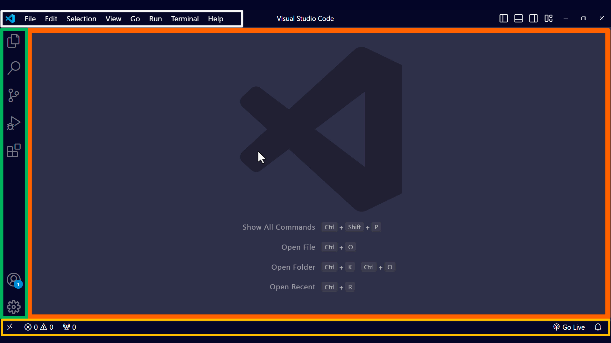

# Introduction to Visual Studio Code

---

## What is a Code Editor?

- Specialized software for writing, editing, and navigating source code.

- Includes features like:
  - Syntax highlighting
  - Code completion
  - Debuggers
  - Customization options
  - Integration with version control systems (e.g., Git, GitHub)

---

## What is Visual Studio Code?

- A code editor developed by Microsoft.

- Supports a wide range of programming languages.

- Key features include:
  - Syntax highlighting
  - Customization options
  - Version control with Git and GitHub
  - Debugging tools
  - AI tools like GitHub Copilot

- Dozens of keyboard shortcuts and productivity features to enhance your workflow.

---

## Why Use VS Code for PowerShell Development?

- Integrated PowerShell extension for scripting and debugging.

- Syntax highlighting and IntelliSense for PowerShell.

- Built-in terminal for running scripts directly.

---

## VS Code for System Administration

- Manage and automate administrative tasks.

- Use extensions for remote management (e.g., SSH, Azure).

- Streamline workflows with task automation.

---

## Key Features of VS Code

- **Customizable Interface**: Themes, layouts, and settings.

- **Extensions Marketplace**: Add functionality as needed.

- **Version Control**: Built-in Git integration.

- **Debugging Tools**: Debug scripts and applications efficiently.

---

## User Interface Overview

### Key Areas

- **Menu Bar** (white)
- **Activity Bar** (green)
- **Editor** (orange)
- **Status Bar** (yellow)

---

## Let's Get Started

- Install VS Code from [code.visualstudio.com](https://code.visualstudio.com/).

- Install the PowerShell extension.

- Explore the interface and features.
